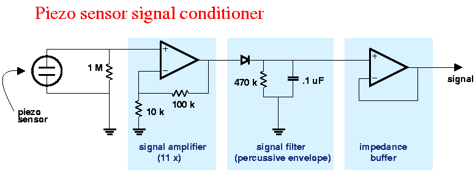

# piezo

Simple piezo analogue value reader thing.

## Important Links

- https://raspberrypi.github.io/pico-sdk-doxygen/group__hardware__adc.html#adc_example
- https://www.ti.com/lit/an/sloa033a/sloa033a.pdf
- https://raspberrypi.github.io/pico-sdk-doxygen/group__pico__stdio.html

## Buffer/Amp Circuit

## Experiments 

### 1 sec of samples

>>> Running piezo_store.py
27638 
>>> Running piezo_store.py
26659
